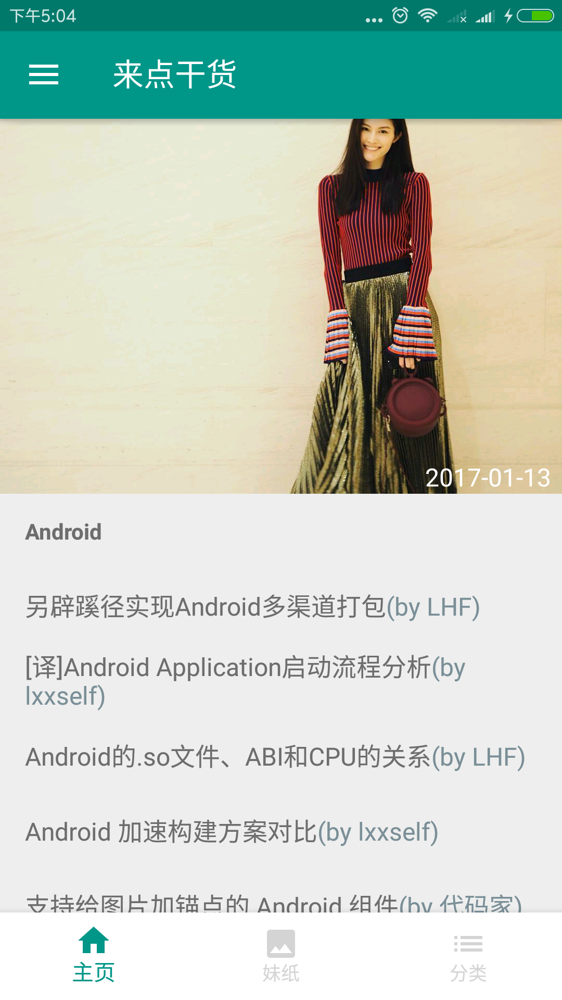
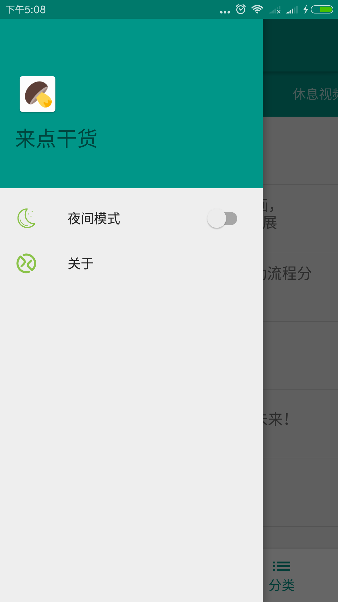
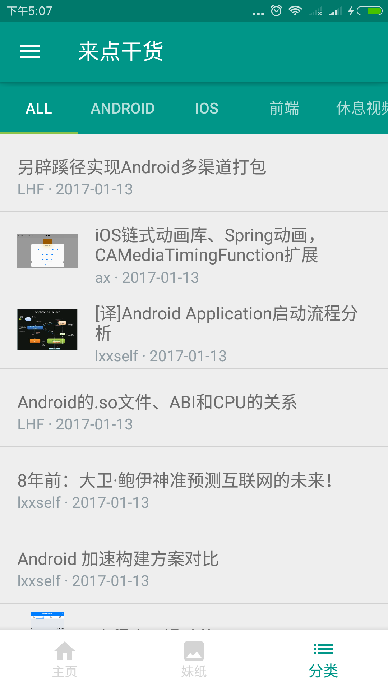
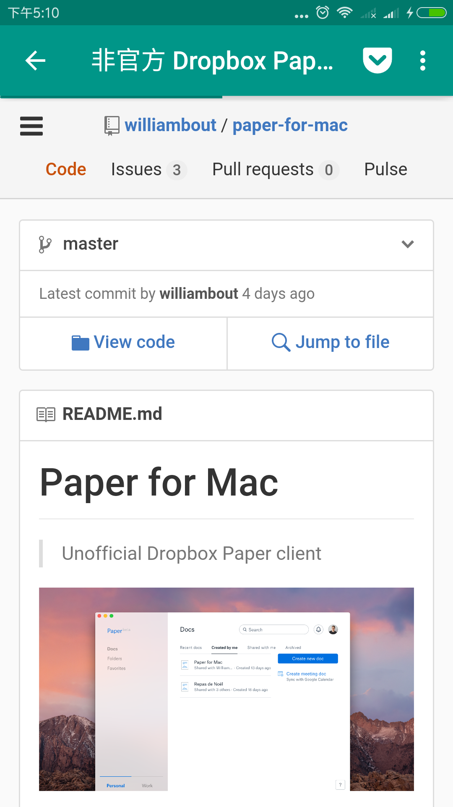
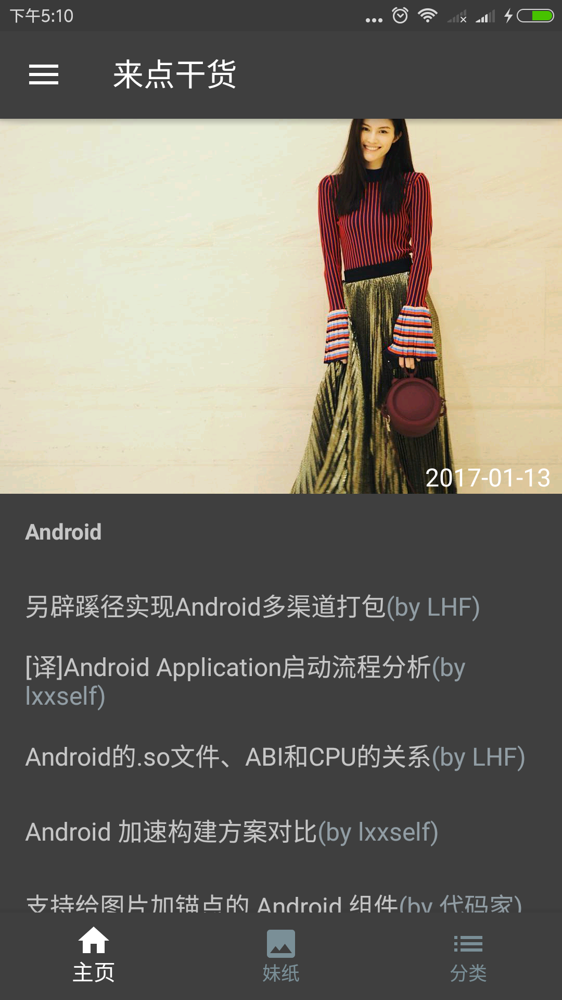
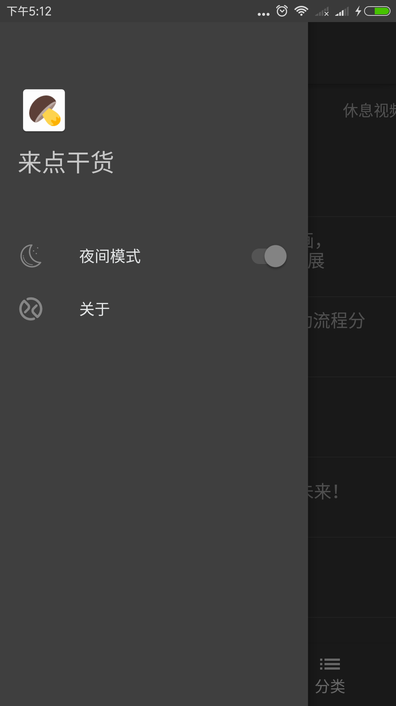
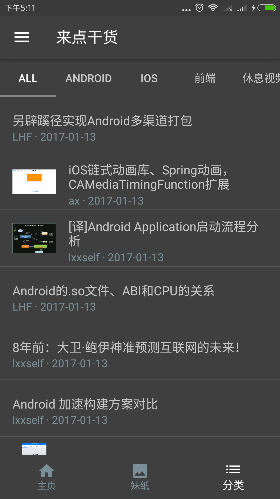
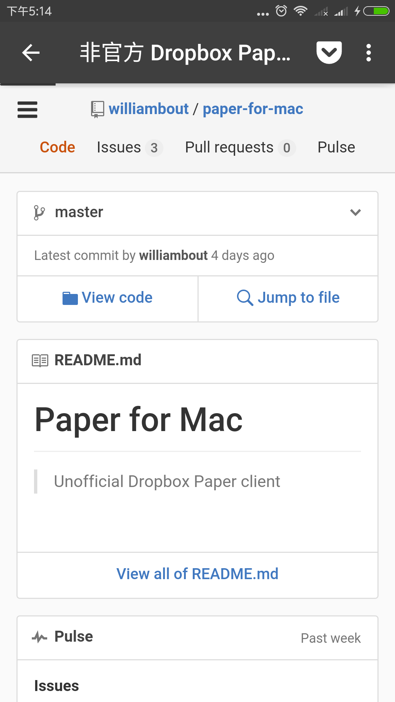

### 来点干货
&nbsp;&nbsp;来点干货提供包括Android,IOS,前端在内技术干货，学习之余可以看看妹子图片和休闲视频。

&nbsp;&nbsp;使用[干货集中营](gank.io)提供的api，采用MVP模式实现模块化编程，减少代码耦合，UI上尽可能遵循Google的MaterialDesign风格，为了方便阅读，还提供了夜间模式。

###应用截图
#### 默认主题

#### 夜间模式

### 下载
* 

[fir.im](https:fir.im/66gank)

### TODO
* 自动更新

###第三方库
* [rxjava](https://github.com/ReactiveX/RxJava)
* [logger](https://github.com/orhanobut/logger)
* [butterknife](https://github.com/JakeWharton/butterknife)
* [retrofit](https://github.com/square/retrofit)
* [photoview](https://github.com/chrisbanes/PhotoView)
* [glide](https://github.com/bumptech/glide)
* [MultiType](https://github.com/drakeet/MultiType)

###参考项目
* [GanHuoIO](https://github.com/burgessjp/GanHuoIO)
* [EasyGank](https://github.com/CaMnter/EasyGank)
* [GankDaily](https://github.com/maoruibin/GankDaily)

###感谢
* [maoruibin](https://github.com/maoruibin)
* [CaMnter](https://github.com/CaMnter)
* [burgessjp](https://github.com/burgessjp)
* [drakeet](https://github.com/drakeet)
* [代码家](https://github.com/daimajia)

### License

    /*
     *       
     * Copyright (C) 2017 AaronChan <aaronchan.me@gmail.com>
     *
     * gank is free software: you can redistribute it and/or modify
     * it under the terms of the GNU General Public License as published by
     * the Free Software Foundation, either version 3 of the License, or
     * (at your option) any later version.
     *
     * gank is distributed in the hope that it will be useful,
     * but WITHOUT ANY WARRANTY; without even the implied warranty of
     * MERCHANTABILITY or FITNESS FOR A PARTICULAR PURPOSE.  See the
     * GNU General Public License for more details.
     *
     * You should have received a copy of the GNU General Public License
     * along with Meizhi.  If not, see <http://www.gnu.org/licenses/>.
     */

